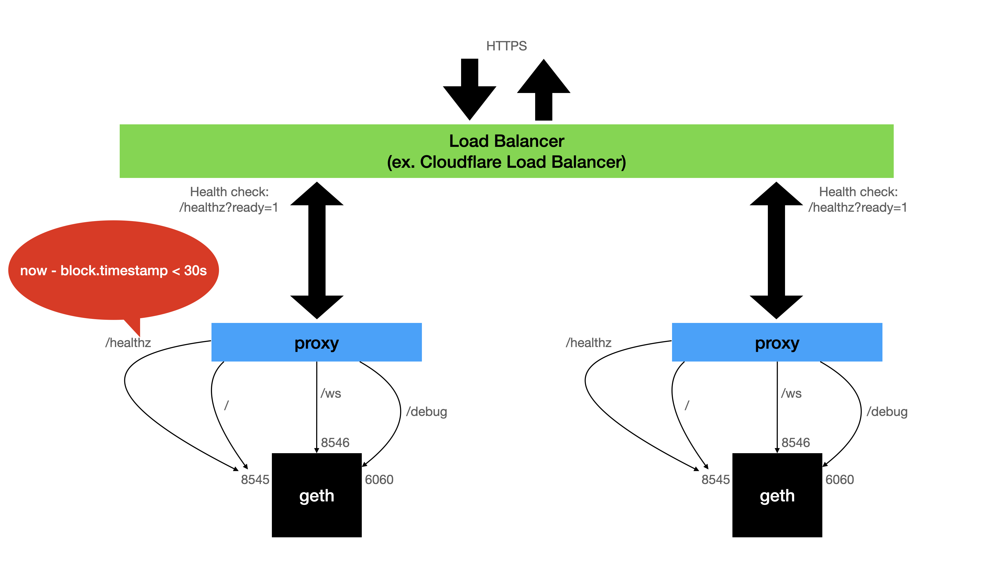

# geth-proxy

Reverse Proxy for geth node

> gcr.io/moonrhythm-containers/geth-proxy



## Features

- Health check base on last synced block timestamp
- Merge websocket port with http port

## Config

| Flag | Type | Description | Default |
| --- | --- | --- | --- |
| -addr | string | HTTP listening address | :80 |
| -tls.addr | string | HTTPS listening address | :443 |
| -tls.key | string | TLS private key file | |
| -tls.cert | stirng | TLS certificate file | |
| -upstream | string[] | Geth address | http://192.168.0.2,ws://192.168.0.2,http://192.168.0.3:8545 |

## Running

### Docker

```shell
#!/bin/bash
NAME=geth-proxy
IMAGE=gcr.io/moonrhythm-containers/geth-proxy
TAG=latest
ARGS="-geth.healthy-duration=15s"

docker pull $IMAGE:$TAG
docker stop $NAME
docker rm $NAME
docker run -d --restart=always --name=$NAME --net=host \
  --log-opt max-size=10m \
  $IMAGE:$TAG $ARGS
```

## License

MIT
