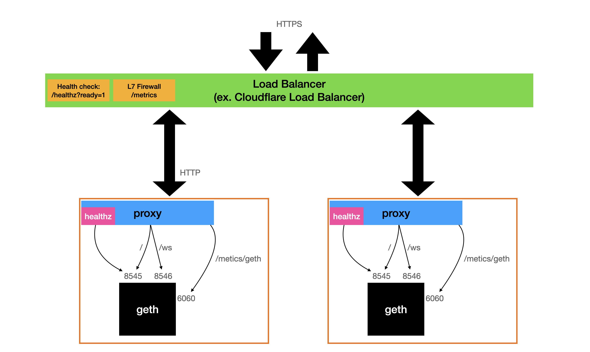

# geth-proxy

Reverse Proxy for geth node

## Why

1. Geth stop sync new block while persisting trie from memory database to disk.
This process took very long time (more than 3 minutes).

2. Geth use difference port for websocket and metrics

## License

MIT
